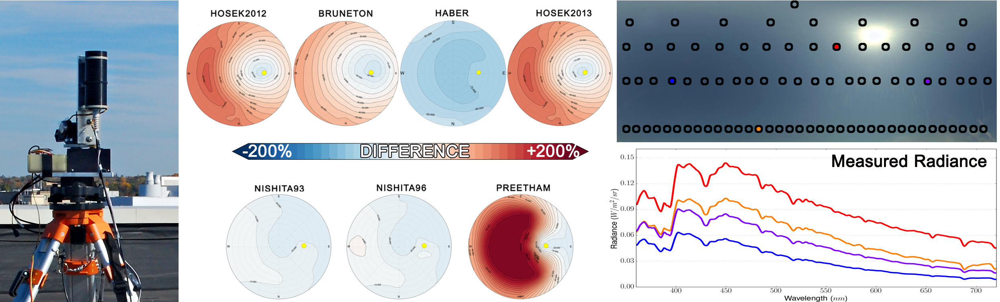

Data Viewer of Spectral Clear Sky Dataset
==================

A data viewer to view the spectral capture data of the clear sky that accompanies our SIGGRAPH ASIA 2014 Paper [A Framework for the Experimental Comparison of Solar and Skydome Illumination](https://dl.acm.org/doi/10.1145/2661229.2661259).

This (original) viewer is written in Python. (The code was orginally authored by *Daniel Knowlton*. However is currently maintanted by [Joseph T. Kider Jr.](http://www.josephkider.com/).)

**Please visit our *current* development repository [spectralskyviewer](https://github.com/spectralskylight/spectralskyviewer)**. (*This repository has been deprecated and retired.*)

**A Framework for the Experimental Comparison of Solar and Skydome Illumination**

[Joseph T. Kider Jr.](http://www.josephkider.com/), [Daniel Knowlton](http://www.danknowlton.com/), [Jeremy Newlin](http://www.jeremynewlin.info/), [Yining Karl Li](https://www.yiningkarlli.com/), and [Donald P. Greenberg](http://www.graphics.cornell.edu/people/director.html)

The illumination and appearance of the solar/skydome is critical for many applications in computer graphics, computer vision, and daylighting studies. Unfortunately, physically accurate measurements of this rapidly changing illumination source are difficult to achieve, but necessary for the development of accurate physically-based sky illumination models and comparison studies of existing simulation models. To obtain baseline data of this time-dependent anisotropic light source, we design a novel acquisition setup to simultaneously measure the comprehensive illumination properties. Our hardware design simultaneously acquires its spectral, spatial, and temporal information of the skydome. To achieve this goal, we use a custom built spectral radiance measurement scanner to measure the directional spectral radiance, a pyranometer to measure the irradiance of the entire hemisphere, and a camera to capture high-dynamic range imagery of the sky. The combination of these computer-controlled measurement devices provides a fast way to acquire accurate physical measurements of the solar/skydome. We use the results of our measurements to evaluate many of the strengths and weaknesses of several sun-sky simulation models. We also provide a measurement dataset of sky illumination data for various clear sky conditions and an interactive visualization tool for model comparison analysis available at:  [**the original clear sky project page at Cornell University's Program of Computer Graphics**](https://web.archive.org/web/20160617174935/http://www.graphics.cornell.edu/resources/clearsky/index.htm).

